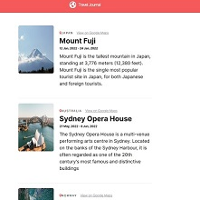

# Task on the topic Next.js

There is application based on `Next.js`:

Using the documentation of [`Next.js`](https://nextjs.org/docs) complete the steps:

1. Create module alias `@/images/*` to `./src/assets/images/*`
2. Write missed `imports` of components `Card`, `Content`, `Navbar` and images `earth.png`, `map-pin.png` to get the application working
3. Configure build to generate static application: `next build` should generate a `dist` directory containing static assets
